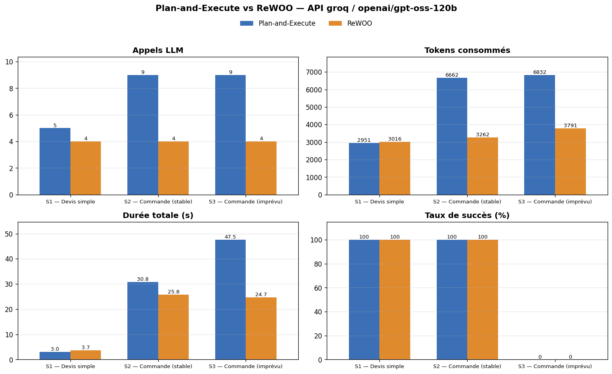

# Synthèse — Atelier 3 IA102 : Plan-and-Execute vs ReWOO

*Généré le 22/09/2026 à 22:16 — mode : API groq / openai/gpt-oss-120b
— LangGraph 1.2.11*

## 1. Protocole
- Cas d'usage : système multi-agents logistique (4 entrepôts), outils `consulter_stock`, `tarifs_transport`,
  `reserver_stock`, `calculatrice` (latence simulée de 0.3 s par appel).
- Scénarios : S1 devis simple ; S2 commande de 120 unités en environnement stable ; S3 même commande avec un
  **incident survenant pendant l'exécution** (blocage des expéditions à Lyon).
- Évaluation sur l'**état réel** de l'environnement (réservations effectives) comparé à l'optimum calculé.
- Répétitions par mesure : 1.

## 2. Résultats mesurés
| scenario | architecture | statut | appels_llm | tokens_total | duree_s | appels_outils | replanifications | cout_reel | cout_optimal |
|---|---|---|---|---|---|---|---|---|---|
| S1 — Devis simple | Plan-and-Execute | ✅ correct | 5 | 4056 | 28.87 | 2 | 0 |  | 252.0 |
| S1 — Devis simple | ReWOO | ✅ correct | 9 | 4924 | 37.26 | 2 | 0 |  | 252.0 |
| S2 — Commande (stable) | Plan-and-Execute | ✅ optimal | 7 | 6224 | 32.82 | 3 | 0 | 212.0 | 212.0 |
| S2 — Commande (stable) | ReWOO | ✅ optimal | 6 | 5129 | 26.38 | 3 | 0 | 212.0 | 212.0 |
| S3 — Commande (imprévu) | Plan-and-Execute | ✅ optimal | 9 | 8825 | 58.85 | 4 | 1 | 224.0 | 224.0 |
| S3 — Commande (imprévu) | ReWOO | ❌ incomplet (80/120) | 5 | 4509 | 34.22 | 4 | 0 | 128.0 | 224.0 |

## 3. Analyse chiffrée
- **S1 — Devis simple** : Plan-and-Execute = 5 appels LLM / 4056 tokens (succès 100 %) ; ReWOO = 9 appels / 4924 tokens (succès 100 %). Plan-and-Execute consomme **0.6×** plus d'appels et **0.8×** plus de tokens.
- **S2 — Commande (stable)** : Plan-and-Execute = 7 appels LLM / 6224 tokens (succès 100 %) ; ReWOO = 6 appels / 5129 tokens (succès 100 %). Plan-and-Execute consomme **1.2×** plus d'appels et **1.2×** plus de tokens.
- **S3 — Commande (imprévu)** : Plan-and-Execute = 9 appels LLM / 8825 tokens (succès 100 %) ; ReWOO = 5 appels / 4509 tokens (succès 0 %). Plan-and-Execute consomme **1.8×** plus d'appels et **2.0×** plus de tokens.

**Variantes (bonus et exercices)**

| scenario | architecture | statut | appels_llm | tokens_total | duree_s | replanifications |
|---|---|---|---|---|---|---|
| S2 — Commande (stable) | ReWOO | ✅ optimal | 5 | 4141 | 29.48 | 0 |
| S2 — Commande (stable) | ReWOO parallèle | ✅ optimal | 5 | 3900 | 24.24 | 0 |
| S1 — Devis simple | P&E économe | ✅ correct | 5 | 3636 | 29.46 | 0 |
| S2 — Commande (stable) | P&E économe | ❌ sur-réservation | 10 | 12802 | 68.95 | 1 |
| S3 — Commande (imprévu) | P&E économe | ✅ optimal | 9 | 9307 | 68.01 | 1 |
| S2 — Commande (stable) | ReWOO hybride | ✅ optimal | 11 | 9265 | 60.4 | 1 |
| S3 — Commande (imprévu) | ReWOO hybride | ✅ optimal | 13 | 14361 | 94.21 | 2 |

## 4. Grille comparative

| Critère | Plan-and-Execute | ReWOO | LLMCompiler |
|---|---|---|---|
| Appels LLM | ≈ 1 + 2 × étapes | 2 + étapes LLM[…] | 1 planif + joiner (+ replanifs) |
| Adaptation aux imprévus | forte | nulle | par cycles (joiner) |
| Latence | élevée | moyenne | faible (parallélisme) |
| Point faible | coût et latence | plan figé, dépend des prévisions | complexité, parsing du DAG |
| À privilégier pour | environnements dynamiques, actions à effets de bord | tâches prévisibles, fort volume, budget contraint | nombreuses sous-tâches indépendantes |

## 5. Enseignements clés
1. **ReWOO est nettement plus économe** en appels LLM et en tokens : le planificateur n'est appelé qu'une fois et les
   observations ne sont jamais renvoyées au LLM, sauf dans les étapes `LLM[…]` prévues.
2. **Plan-and-Execute est le seul à réussir quand la réalité diverge du plan** (S3) : la re-planification transforme un
   échec d'action en simple détour, au prix d'appels supplémentaires.
3. Le coût de Plan-and-Execute vient surtout du **re-planificateur appelé à chaque étape** ; ne l'appeler qu'en cas
   d'échec (exercice 2) réduit fortement ce surcoût tout en conservant l'adaptabilité.
4. Un **ReWOO hybride** (vérificateur + re-planification sur échec, exercice 3) combine sobriété nominale et capacité
   de rattrapage : c'est l'idée reprise par le *joiner* de LLMCompiler.
5. L'évaluation d'un agent doit porter sur **ses actions réelles**, pas seulement sur son discours.

## 6. Vos conclusions (à compléter)
- **Q1 — Environnement prévisible (S1, S2)** : …
- **Q2 — Changement dynamique (S3)** : …
- **Q3 — Pourquoi ReWOO échoue-t-il sur S3 ?** : …
- **Q4 — Optimisation de Plan-and-Execute** : …
- **Q5 — Recommandation pour votre organisation** (quelle architecture, pour quel processus, avec quels garde-fous ?) : …
