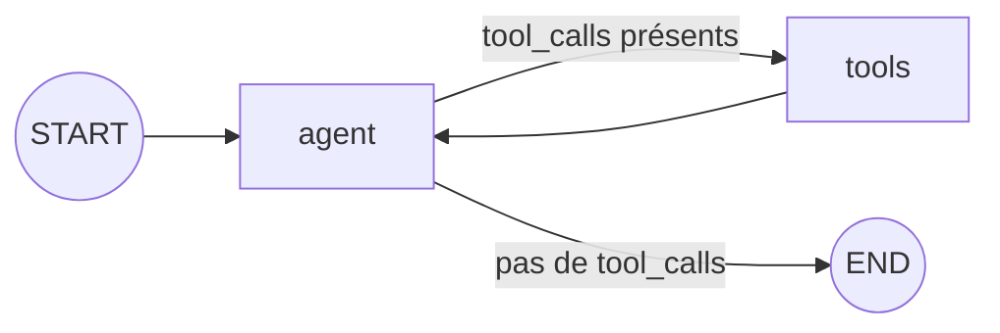

# Agent ReAct avec LangGraph : explication ligne à ligne

Ce code construit un **agent conversationnel capable d'appeler des outils** (pattern *ReAct* : raisonner → agir → observer → recommencer) avec **mémoire de conversation** persistée par fil de discussion.

---

## Vue d'ensemble du graphe



L'agent (le LLM) décide à chaque tour : soit il demande l'exécution d'un ou plusieurs outils, soit il donne sa réponse finale. Après l'exécution des outils, la main revient toujours au LLM.

---

## 1. Les imports

```python
from typing import Annotated, TypedDict
```
- **`TypedDict`** : permet de déclarer un dictionnaire dont les clés et les types sont fixés. Sert à décrire la forme de l'**état** du graphe.
- **`Annotated`** : permet d'attacher une métadonnée à un type. LangGraph s'en sert pour associer une **fonction de fusion (reducer)** à un champ de l'état.

```python
from langgraph.graph import StateGraph, START, END
```
- **`StateGraph`** : la classe qui construit un graphe dont les nœuds lisent et modifient un état partagé.
- **`START`** : nœud virtuel représentant le point d'entrée du graphe.
- **`END`** : nœud virtuel représentant la fin de l'exécution. *(Il est importé mais pas utilisé explicitement ici : c'est `tools_condition` qui y fait référence en interne.)*

```python
from langgraph.graph.message import add_messages
```
- **`add_messages`** : un *reducer* prêt à l'emploi pour les listes de messages. Au lieu d'**écraser** la liste, il **ajoute** les nouveaux messages à la suite (et remplace un message existant s'il porte le même `id`). Il convertit aussi les formats simples (tuples, dicts) en objets messages LangChain.

```python
from langgraph.prebuilt import ToolNode, tools_condition
```
- **`ToolNode`** : un nœud préfabriqué qui lit les `tool_calls` du dernier message de l'IA, exécute les outils correspondants et renvoie leurs résultats sous forme de `ToolMessage`.
- **`tools_condition`** : une fonction de routage préfabriquée. Elle regarde le dernier message : s'il contient des appels d'outils, elle renvoie `"tools"`, sinon elle renvoie `END`.

```python
from langgraph.checkpoint.memory import InMemorySaver
```
- **`InMemorySaver`** : un *checkpointer* qui sauvegarde l'état du graphe **en mémoire vive** après chaque étape. C'est lui qui donne la mémoire de conversation.

---

## 2. La définition de l'état

```python
class State(TypedDict):
    messages: Annotated[list, add_messages]
```
- L'état du graphe ne contient qu'une clé : **`messages`**, une liste.
- `Annotated[list, add_messages]` signifie : « quand un nœud renvoie une valeur pour `messages`, **fusionne-la** avec l'existant via `add_messages` ».
- Sans ce reducer, chaque nœud **remplacerait** tout l'historique par ce qu'il renvoie ; on perdrait la conversation.

---

## 3. Le nœud « agent »

```python
def agent(state: State):
```
- Déclare une fonction qui deviendra un nœud. Tout nœud LangGraph reçoit l'**état courant** en paramètre.

```python
    return {"messages": [llm_tools.invoke(state["messages"])]}
```
- `state["messages"]` : tout l'historique de la conversation (messages utilisateur, réponses de l'IA, résultats d'outils).
- `llm_tools.invoke(...)` : envoie cet historique au LLM et récupère un `AIMessage`. Ce message contient soit une réponse textuelle, soit des **`tool_calls`** (demandes d'appel d'outils).
- Le nœud renvoie une **mise à jour partielle** de l'état : `{"messages": [réponse]}`. Grâce à `add_messages`, cette réponse est **ajoutée** à l'historique.

> ⚠️ `llm_tools` n'est pas défini dans cet extrait. Il s'agit d'un modèle de chat auquel on a lié les outils, typiquement :
> ```python
> llm_tools = llm.bind_tools(tools)
> ```
> `bind_tools` décrit les outils au LLM (nom, description, paramètres) pour qu'il sache qu'il peut les appeler.

---

## 4. La construction du graphe

```python
g = StateGraph(State)
```
- Crée un constructeur de graphe dont l'état suit le schéma `State`.

```python
g.add_node("agent", agent)
```
- Ajoute un nœud nommé `"agent"` qui exécute la fonction `agent`.

```python
g.add_node("tools", ToolNode(tools))
```
- Ajoute un nœud nommé `"tools"` qui exécute les outils de la liste `tools`.
- Le nom `"tools"` n'est pas arbitraire : c'est la valeur que renvoie `tools_condition`. Si on nomme ce nœud autrement, il faut fournir une table de correspondance à `add_conditional_edges`.

> ⚠️ `tools` n'est pas défini dans l'extrait : c'est une liste d'outils (fonctions décorées avec `@tool`, par exemple).

```python
g.add_edge(START, "agent")
```
- Arête fixe : l'exécution commence toujours par le nœud `agent`.

```python
g.add_conditional_edges("agent", tools_condition)
```
- Arête **conditionnelle** : après `agent`, on appelle `tools_condition(state)` pour choisir la suite :
  - le dernier message contient des `tool_calls` → on va vers `"tools"` ;
  - sinon → on va vers `END` (la réponse finale est prête).

```python
g.add_edge("tools", "agent")
```
- Arête fixe : après l'exécution des outils, on revient **toujours** à l'agent, pour que le LLM lise les résultats et décide de la suite. C'est cette arête qui crée la **boucle ReAct**.

```python
graph = g.compile(checkpointer=InMemorySaver())
```
- **`compile()`** valide le graphe (nœuds atteignables, arêtes cohérentes) et produit un objet exécutable (`graph`) disposant des méthodes `invoke`, `stream`, etc.
- **`checkpointer=InMemorySaver()`** : active la sauvegarde de l'état après chaque étape. Sans checkpointer, chaque appel repartirait d'un état vide.

---

## 5. L'exécution

```python
cfg = {"configurable": {"thread_id": "demo-1"}}
```
- Configuration d'exécution. Le **`thread_id`** identifie un fil de conversation : le checkpointer stocke un historique distinct par `thread_id`.
- Réutiliser `"demo-1"` lors d'un prochain appel reprend la même conversation ; utiliser `"demo-2"` démarre une conversation vierge.
- Avec un checkpointer, le `thread_id` est **obligatoire** : sans lui, l'appel lève une erreur.

```python
graph.invoke({"messages": [("user", "Bonjour")]}, cfg)
```
- Lance le graphe avec une entrée : un message utilisateur « Bonjour ».
- Le tuple `("user", "Bonjour")` est converti automatiquement en `HumanMessage` par `add_messages`.
- Déroulé probable ici :
  1. `START` → `agent` : le LLM reçoit « Bonjour » ;
  2. il répond par un simple salut, sans `tool_calls` ;
  3. `tools_condition` → `END`.
- `invoke` **renvoie l'état final** (un dict avec la clé `messages` contenant les deux messages). Dans l'extrait, ce retour n'est ni stocké ni affiché ; pour voir la réponse :
  ```python
  result = graph.invoke({"messages": [("user", "Bonjour")]}, cfg)
  print(result["messages"][-1].content)
  ```

---

## 6. Exemple de déroulé avec appel d'outil

Si l'utilisateur demande « Quelle heure est-il à Tokyo ? » et qu'un outil `get_time(city)` existe :

| Étape | Nœud | Message ajouté à l'état |
|---|---|---|
| 1 | *entrée* | `HumanMessage("Quelle heure est-il à Tokyo ?")` |
| 2 | `agent` | `AIMessage(tool_calls=[get_time(city="Tokyo")])` |
| 3 | `tools` | `ToolMessage("06:12", tool_call_id=...)` |
| 4 | `agent` | `AIMessage("Il est 6 h 12 à Tokyo.")` |
| 5 | → `END` | *(pas de tool_calls, fin)* |

---

## 7. Points d'attention

- **`InMemorySaver` est volatile** : tout l'historique disparaît à l'arrêt du processus. En production, on utilise un checkpointer persistant (SQLite, PostgreSQL…).
- **L'historique grossit indéfiniment** : chaque tour renvoie toute la conversation au LLM. Au-delà d'une certaine longueur, il faut tronquer ou résumer les messages.
- **Risque de boucle** : si le LLM rappelle des outils sans fin, le graphe s'arrête avec une `GraphRecursionError` (limite par défaut configurable via `{"recursion_limit": N}` dans `cfg`).
- Ce graphe reproduit ce que fait `create_react_agent` de `langgraph.prebuilt` ; l'écrire à la main permet de le personnaliser (ajout de nœuds, validation humaine, etc.).
